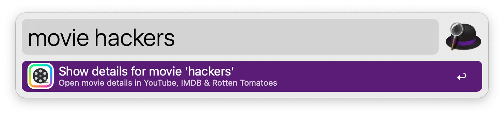

# Should I watch this movie?

Open a trailer in YouTube, details in IMDB and ratings in Rotten Tomatoes.

[⤓ Install From the Alfred Gallery](https://alfred.app/workflows/alfredapp/should-i-watch-this-movie/)

## Usage

Type your keyword *("movie" by default)* followed by the name of a movie you'd like to watch.

IMDB and Rotten Tomatoes will open in your default browser, and YouTube will open in Chrome, with the results for your search term.

## Configuration

Fancy checking a few more sites? Add your own searches, and connect them to the same keyword object.

YouTube opens in Chrome to demonstrate that Default Web Searches and Open URL objects can be set to open in a browser of your choice.

